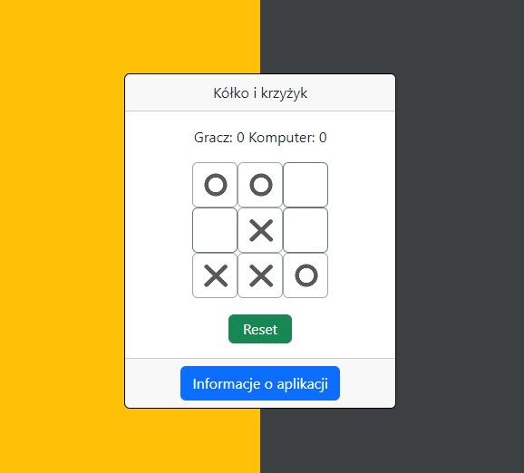

# :desktop_computer: TicTacToe

The application automatically randomly selects one of the available fields on the board after the user clicks. Then it places its X mark on that field. The game ends when one of the players aligns three marks in a row or the board is filled, resulting in a draw.

## :framed_picture: Screenshots

## :joystick: Demo

https://kamilkeder.github.io/TicTacToe/

## :e-mail: Feedback

If you have any feedback, please reach out to me at kontaktkkeder@gmail.com
